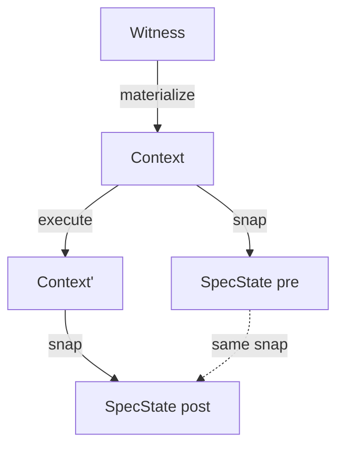

# Vericoding

## Verification-Driven Development

From behavioural features to machine-checked proofs

<div class="pt-12">
  <span class="text-gray-400">Gavin Mendel-Gleason · Scidonia · July 2026</span>
</div>

---
layout: two-cols
---

# Vibecoding

The status quo of LLM-driven development.

<br>

<div class="border-l-4 border-red-400 pl-4">

**You prompt.  The model emits.  It runs.**

What you leave behind:

- **No specification** of intended behaviour
- **No evidence** of correctness
- **No conformance regime** for the next generation

The only durable artifact is the code itself.
</div>

::right::

# Vericoding

The methodology specsaver operationalises.

<br>

<div class="border-l-4 border-green-400 pl-4">

**You write a specification.  The spec survives.**

What you leave behind:

- **Features** — Gherkin scenarios domain experts can review
- **Contracts** — mathematical pre/post-conditions
- **Proof obligations** — machine-checked in Rocq/Coq

Generated code is a replaceable implementation detail.
</div>

---

# Two Development Flows

::left::

## Retrospective

<div class="border-l-4 border-yellow-400 pl-3 text-sm">

- **Feature** — Gherkin scenario tables
- **Implementation** — write the production code
- **Testing (sanity)** — make sure it basically works
- **Contract** — capture observed behaviour as mathematical spec
- **Testing (dialectic)** — re-run under contract checking; either contract or implementation is wrong — the dialectic
- **Formal Proof** — lower to Coq, LLM closes obligations; DISPROVED → back to dialectic

</div>

::right::

## Contract-First

<div class="border-l-4 border-cyan-400 pl-3 text-sm">

- **Feature** — Gherkin scenario tables
- **Contract** — write spec as acceptance criteria
- **Implementation** — build code against the specification
- **Testing** — validate that implementation satisfies contract
- **Formal Proof** — machine-checked against kernel

</div>

<div class="mt-6 text-center text-xs text-green-400 font-bold">
Both converge: the contract is the lasting artifact.<br>
DISPROVED yields witnesses → back to the dialectic.
</div>

---

# Contract Language

::left::

## The pure terminating fragment of Python

<br>

Every clause is a boolean-valued lambda:

- `requires(state, args)` — admissibility
- `ensures(state, args, result, new_state)` — success post
- `when(state, args)` — exception conditions
- `invariant(state)` — global legality

**Static purity check** rejects side effects,
loops, and non-boolean returns before execution.

::right::

## Anatomised as mathematical record

<br>

$$
\begin{aligned}
C =\; &\langle \Sigma,\; \mathit{args},\; \mathsf{pre},\; \mathsf{post},\\
      &\quad\; \mathcal{X},\; \mathcal{I},\; \mathcal{D},\; \mathcal{W},\; \mathcal{R},\; \mathcal{G} \rangle
\end{aligned}
$$

<div class="text-sm mt-4">

$\mathcal{X}$  —  exceptional exits (when + ensures + frame)

$\mathcal{I}$  —  invariants on every state

$\mathcal{D}$  —  derived-state definitions

$\mathcal{W}$ / $\mathcal{R}$  —  semantic frame

$\mathcal{G}$  —  ghost state

</div>

---
---

# Semantic Frames

Declare **what you write**, not what you don't.

<div class="grid grid-cols-2 gap-4 mt-6">
<div class="bg-gray-800 rounded p-4">

### Write paths

```python
writes = {
    "state.products[sku].reserved",
    "state.invitations[token]",
    "state.reservation_log",
}
```

</div>
<div class="bg-gray-800 rounded p-4">

### Derived obligations

<div class="text-sm space-y-2 mt-2">
<div class="text-green-400">✓</div> Every other keyed attribute unchanged
<div class="text-green-400">✓</div> Every other keyed row untouched
<div class="text-green-400">✓</div> All other event channels silent
<div class="text-green-400">✓</div> Deletions always rejected
<div class="text-green-400">✓</div> Keyed-row inserts allowed for args-resolved keys
</div>
</div>
</div>

<div class="mt-4 text-sm text-gray-400">
The checker derives frame soundness from write paths alone.
No "everything else unchanged" clauses needed.
</div>

---
---

# Exception Exits

Exceptions are **data**, not control flow.

```python {all|3-6|7|8-11}
exceptions = [
    ExcExit(
        raises = InsufficientStockError,
        when   = [lambda s, a:
                   s.products[a.sku].on_hand
                 - s.products[a.sku].reserved < a.quantity],
        writes = {"state.failure_log"},
        ensures = [lambda s, a, e, s':
                    extends_by_one(
                       s.failure_log, s'.failure_log,
                       λf. f.sku == a.sku
                           ∧ f.reason == e.code)]
    )
]
```

<div class="text-sm text-gray-400 mt-4">
The runner checks: correct exception raised, failure telemetry contains exactly one new event with exact fields, nothing outside the exit's writes changed.
</div>

---

# Symmetric Projection

<div class="grid grid-cols-2 gap-4 mt-4 text-sm">

<div>

**One function, used twice.**

The projection `snap(ctx) → SpecState` reads the concrete world
(SQLite DB + event log) into an immutable spec state.  It is called
*identically* before and after execution — no separate "read" and
"check" path.

</div>

<div>



</div>

</div>

<div class="mt-4 text-xs text-gray-400">
Contracts compare pre and post produced by the same projection function.
The service is ordinary SQLAlchemy code — it knows nothing about specs.
</div>

---

# Symmetric Projection — Runner

<div class="grid grid-cols-2 gap-3 mt-4 text-sm">

<div class="space-y-1">
<div class="text-orange-300">1. materialize</div>
<div class="text-xs text-gray-400 ml-3">witness → temp SQLite DB + engine + EventLog</div>

<div class="text-orange-300">2. pre-check</div>
<div class="text-xs text-gray-400 ml-3">invariants on pre-state; admissibility (requires)</div>

<div class="text-orange-300">3. execute</div>
<div class="text-xs text-gray-400 ml-3">service runs against real SQLite via SQLAlchemy;<br>wrapper emits typed events into the log</div>
</div>

<div class="space-y-1">
<div class="text-orange-300">4. frame check</div>
<div class="text-xs text-gray-400 ml-3">everything outside writes unchanged</div>

<div class="text-orange-300">5. derived check</div>
<div class="text-xs text-gray-400 ml-3">derived fields ≡ recomputed from observed</div>

<div class="text-orange-300">6. post-check</div>
<div class="text-xs text-gray-400 ml-3">ensures (or exit ensures) for the outcome;<br>invariants on post-state</div>
</div>

</div>

---
---

# Domain Declaration

One object → runners, CLI, conformance suite.

```python {all|3-4|5-7|8-10}
inventory = SqlDomain(
    name         = "inventory",
    package      = "examples.inventory",
    materializer = SqlMaterializer(ddl, TableSpec[]),
    projection   = SqlProjection(types, hooks),
    operations   = [
        SqlOperation(contract, wrapper,
                     witness_builder, feature_file),
        ...
    ]
)
```

<div class="grid grid-cols-3 gap-4 mt-4 text-sm">
<div class="border border-cyan-800 rounded p-2 text-center">scenario runners</div>
<div class="border border-cyan-800 rounded p-2 text-center">CLI dispatch</div>
<div class="border border-cyan-800 rounded p-2 text-center">conformance tests</div>
</div>

<div class="mt-4 text-sm text-gray-400">
Adding a domain: types + service + contracts + features + witness builders + one declaration.
Everything else (materializer, projection, runner wiring, test dispatch) is derived.
</div>

---
---

# Theory Stack

Services run **unmodified** on differentially-tested stubs.

<div class="space-y-1 mt-6 text-sm">
<div class="bg-blue-900/30 rounded p-2">
<span class="text-blue-300 font-bold">Service</span>
<span class="text-gray-400 ml-2">ordinary SQLAlchemy / logging / OTel API code</span>
</div>

<div class="bg-orange-900/30 rounded p-2">
<span class="text-orange-300 font-bold">Shim</span>
<span class="text-gray-400 ml-2">make_engine, make_log_capture, make_otel_capture</span>
</div>

<div class="bg-green-900/30 rounded p-2">
<span class="text-green-300 font-bold">StubHandler</span>
<span class="text-gray-400 ml-2">operational semantics over the state model</span>
</div>

<div class="bg-green-900/20 rounded p-2">
<span class="text-green-400 font-bold">State model</span>
<span class="text-gray-400 ml-2">TableStore / LogStore / OtelStore</span>
</div>

<div class="bg-gray-800 rounded p-2">
<span class="text-gray-500 font-bold">Trace</span>
<span class="text-gray-400 ml-2">final interpretation (events)</span>
</div>
</div>

<div class="mt-6 border border-purple-800 rounded p-3 text-sm">
<span class="text-purple-300 font-bold">Theory conformance:</span>
Stub and real library agree observationally on a differential suite;
translator rejects out-of-fragment input loudly;
state model and trace are pure data.
</div>

---
---

# Lowering Pipeline

<div class="grid grid-cols-4 gap-3 mt-8">
<div class="bg-blue-900/30 rounded p-3 text-center">
<span class="text-blue-300 block text-lg font-bold">Contract</span>
<span class="text-xs text-gray-400">Python lambdas</span>
</div>
<div class="text-2xl self-center text-center">→</div>
<div class="bg-orange-900/30 rounded p-3 text-center">
<span class="text-orange-300 block text-lg font-bold">introspect</span>
<span class="text-xs text-gray-400">shape extraction<br>deltas, scalars, arms</span>
</div>
<div class="text-2xl self-center text-center">→</div>
<div class="bg-orange-900/30 rounded p-3 text-center">
<span class="text-orange-300 block text-lg font-bold">emit</span>
<span class="text-xs text-gray-400">gen_pre / gen_post<br>+ obligation set</span>
</div>
<div class="text-2xl self-center text-center">→</div>
<div class="bg-green-900/30 rounded p-3 text-center">
<span class="text-green-300 block text-lg font-bold">score</span>
<span class="text-xs text-gray-400">coqc compile<br>per-obligation bisection</span>
</div>
</div>

<div class="grid grid-cols-3 gap-4 mt-8">
<div class="bg-green-900/40 rounded p-4 text-center">
<span class="text-green-300 font-bold text-xl block">PROVED</span>
<span class="text-xs text-gray-400">machine-checked against kernel</span>
</div>
<div class="bg-yellow-900/30 rounded p-4 text-center">
<span class="text-yellow-300 font-bold text-xl block">UNKNOWN</span>
<span class="text-xs text-gray-400">queued for LLM proof oracle</span>
</div>
<div class="bg-red-900/30 rounded p-4 text-center">
<span class="text-red-300 font-bold text-xl block">DISPROVED</span>
<span class="text-xs text-gray-400">runtime counterexample found</span>
</div>
</div>

---
---

# Example: Inventory Reserve

<div class="text-sm">

**Pre-condition:**
$$
\mathsf{pre}(s, a) \;=\; a.\mathit{quantity} > 0 \;\wedge\; a.\mathit{sku} \in s.\mathit{products}
$$

**Post-condition (excerpt):**
$$
\begin{aligned}
\mathsf{post}(s, a, r, s') \;=\;&
s'.\mathit{products}[a.\mathit{sku}].\mathit{reserved}
  \;=\; s[\,\cdot\,].\mathit{reserved} + a.\mathit{quantity} \\
\wedge\;& \mathsf{extends\_by\_one}(s.\mathit{reservation\_log},\, s'.\mathit{reservation\_log},\,
      \lambda e.\; e.\mathit{sku} = a.\mathit{sku}) \\
\wedge\;& \mathsf{implies}(\mathit{crossed}(s,a,s'),\;
      \mathsf{extends\_by\_one}(s.\mathit{alert\_log},\, s'.\mathit{alert\_log},\;
        \ldots))
\end{aligned}
$$

**Exception exit:**
$$
\mathcal{X} = \bigl\{\,
\langle \mathsf{InsufficientStock},\;
       s.\mathit{available}(a.\mathit{sku}) < a.\mathit{quantity},\;
       \{\mathit{failure\_log}\},\;
       \mathsf{failure\_ensures}
\rangle \,\bigr\}
$$

</div>

---
---

# Example: Invitations

<div class="text-sm">

<div>
<div>

**Invite** (insert frame):
$$
\begin{aligned}
\mathsf{post}_{\mathit{invite}}(s,a,r,s') =\;&
s'.\mathit{invitations}[a.\mathit{token}].\mathit{status} = \text{pending} \\
\wedge\;& s'.\mathit{invitations}[a.\mathit{token}].\mathit{expires\_at}
       = a.\mathit{now} + 7\!\cdot\!86400
\end{aligned}
$$

</div>
<div>

**Accept** (multi-table delta):
$$
\begin{aligned}
\mathsf{post}_{\mathit{accept}}(s,a,r,s') =\;&
s'.\mathit{invitations}[a.\mathit{token}].\mathit{status} = \text{accepted} \\
\wedge\;& s'.\mathit{members}[a.\mathit{user\_id}].\mathit{org\_id}
       = s.\mathit{invitations}[a.\mathit{token}].\mathit{org\_id} \\
\wedge\;& s'.\mathit{users}[a.\mathit{user\_id}].\mathit{default\_org}
       = s.\mathit{invitations}[a.\mathit{token}].\mathit{org\_id}
\end{aligned}
$$

</div>
</div>

<div class="border border-purple-800 rounded p-3 mt-6 text-sm">
<span class="text-purple-300">Design decisions for verifiability:</span>
Token is a caller-supplied argument (args-resolved insert key).
<span class="text-yellow-300">now</span> is an integer epoch argument (expiry is a pure comparison).
</div>

</div>

---

# Verified State

::left::

| Domain | Tables | Ops | Rows | Obligations |
|--------|--------|-----|------|-------------|
| inventory | 1 | 3 | 22 | 6/6, 6/6, 4/4 |
| bank_transfer | 2 | 1 | 11 | 7/7 |
| invitations | 3 | 2 | 9 | runtime-only |
| **Total** | | **6** | **42** | **23 in 23** |

<br>

<div class="text-sm text-gray-400">
All four store-obligation contracts fully proved in Rocq.
Trace obligations (extends_by_one) active in development.
</div>

::right::

<div class="mt-4 ml-4">

```coq
Definition gen_post (sigma : sn_state)
    (vs : list sn_val) (r : Result)
    (ups : cell_updates) : Prop :=
  exists sku order quantity store_d
         on_hand_sku reserved_sku
         reorder_point_sku,
    vs = [LitString sku;
          LitString order;
          LitInt quantity] /\
    sigma !! store_loc =
      Some (LitDict store_d) /\
    dict_lookup_str sku store_d =
      Some (row_of on_hand_sku
                 reserved_sku
                 reorder_point_sku) /\
    r = RVal (LitInt reserved_sku) /\
    ups = [(store_loc,
            LitDict
              (dict_insert_str sku
                (row_of on_hand_sku
                  (reserved_sku + quantity)
                  reorder_point_sku)
                store_d))].
```

</div>

---
---

# The Vericoding Promise

<div class="text-lg text-center mt-8 space-y-6">

<div class="border border-red-800 rounded p-4 max-w-lg mx-auto">
<span class="text-red-300 font-bold">Vibecoding leaves</span><br>
<span class="text-gray-400">code and hope</span>
</div>

<div class="text-3xl text-gray-500">$\downarrow$</div>

<div class="border border-green-800 rounded p-4 max-w-lg mx-auto">
<span class="text-green-300 font-bold">Vericoding leaves</span><br>
<span class="text-gray-400">a specification and evidence</span>
</div>

</div>

<div class="mt-12 text-center text-sm text-gray-400">
specsaver · github.com/scidonia/specsaver
</div>

<style>
h1 {
